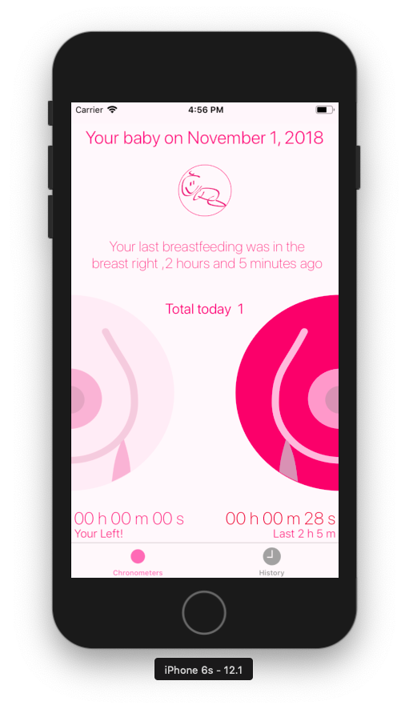
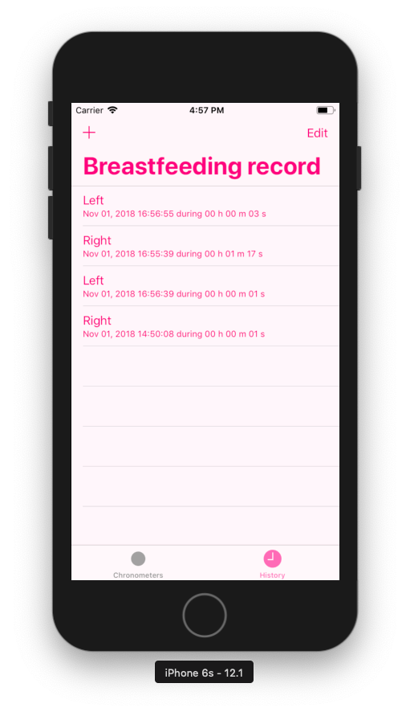
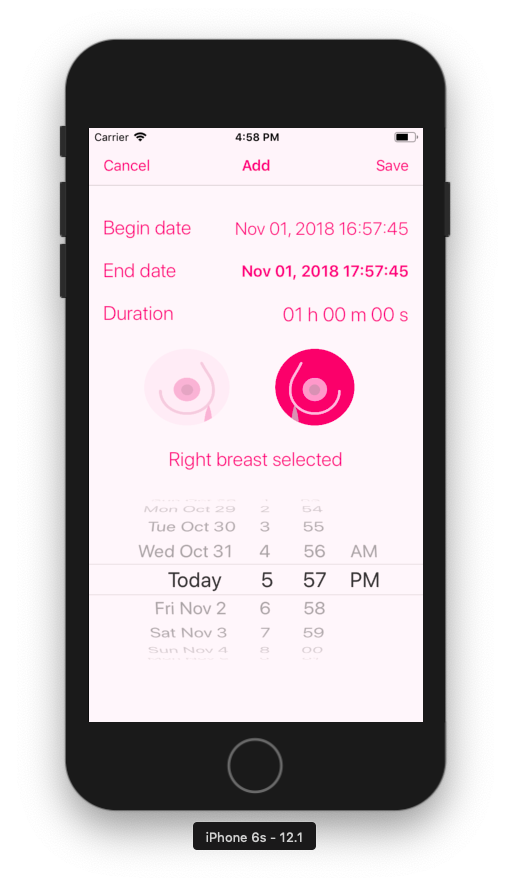

# Simple breastfeeding: Remember the breast

## Description

IOS application to take the breastfeeding time of your baby

* Chronometers: One or two breasts at a time

* Historic of breastfeeding

* Add breastfeeding to historic

## Usage

Once the project has been downloaded, import into XCode and compile

## Versioning

We use [SemVer](http://semver.org/) for versioning. For the versions available, see the [tags on this repository](https://github.com/rvillamil/vws-js-app/tags).

## License

This project is licensed under the MIT License - see the [LICENSE.md](LICENSE.md) file for details.
